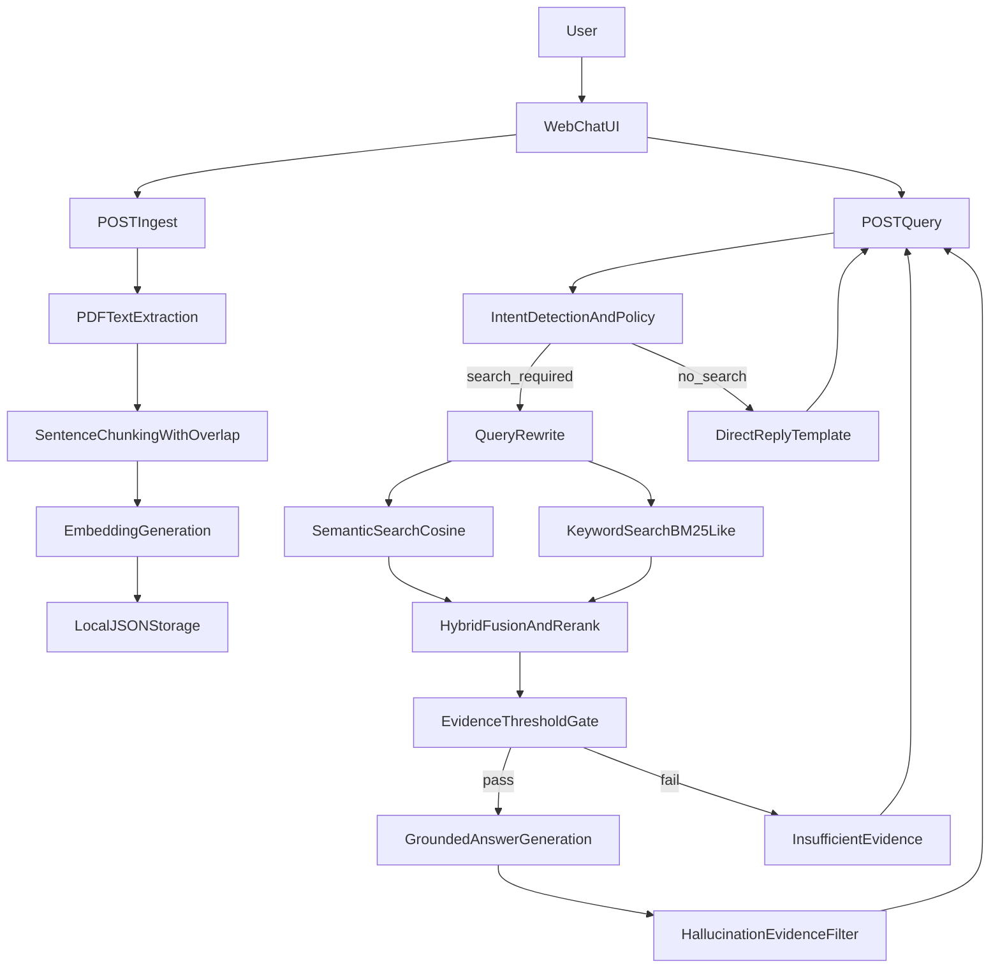

# StackAI Interview Assignment - RAG Backend + UI

This repository implements a complete Retrieval-Augmented Generation (RAG) system over PDF files using FastAPI and Mistral AI APIs, with a built-in web chat UI.

## Live Demo

- UI: [https://stackai-rag.onrender.com/](https://stackai-rag.onrender.com/)
- API Docs: [https://stackai-rag.onrender.com/docs](https://stackai-rag.onrender.com/docs)

## What This Project Includes

- `POST /ingest` endpoint for uploading one or more PDF files.
- Custom PDF extraction and chunking pipeline (no external RAG/search framework).
- Query processing pipeline:
  - intent detection (including no-search intents like greetings),
  - query rewriting for better retrieval.
- Custom hybrid retrieval:
  - semantic similarity via Mistral embeddings + cosine similarity in Python,
  - keyword retrieval via BM25-like scoring implemented from scratch.
- Post-processing and reranking:
  - weighted fusion + reciprocal rank signal,
  - duplicate suppression and document diversity.
- Generation with Mistral chat completion and grounded context prompts.
- Bonus safeguards:
  - citation-required behavior,
  - insufficient evidence threshold return,
  - answer shaping by intent (structured/list mode),
  - post-hoc evidence check for unsupported claims,
  - refusal policy stubs for sensitive requests (PII/legal/medical).
- Vanilla HTML/JS chat UI served directly by FastAPI.

## Architecture



## Design Choices and Considerations

### 1) PDF text extraction and chunking

Implementation details:
- Use `pypdf` to extract text page-by-page.
- Normalize whitespace to reduce extraction noise.
- Split by sentence boundaries, then build chunks with:
  - min chunk size to avoid weak fragments,
  - max chunk size to keep context focused and cheap,
  - overlap window to improve recall across boundaries.
- Store page ranges in each chunk for citations.

Tradeoffs considered:
- Larger chunks improve context continuity but can reduce retrieval precision.
- Smaller chunks improve precision but can harm answer completeness.
- Overlap improves recall but increases index size and possible duplication.
- PDF extraction quality varies; normalization and deduplication help stability.

### 2) Query processing

- Intent router avoids unnecessary retrieval for small-talk/greetings.
- Query rewrite removes conversational fluff and preserves core terms.
- Refusal detectors route disallowed requests to safe responses.

### 3) Hybrid retrieval

- Semantic path:
  - embed query and chunk texts with Mistral embeddings,
  - compute cosine similarity in pure Python.
- Keyword path:
  - tokenize chunks and query,
  - compute BM25-like score with TF/IDF and length normalization.
- Fusion:
  - normalize semantic and keyword scores,
  - combine with weighted sum + reciprocal rank fusion feature.

### 4) Post-processing and reranking

- Suppress near duplicates using token signature checks.
- Limit over-representation of one document in top results.
- Apply evidence threshold gate:
  - if top score < configured threshold, return `insufficient evidence`.

### 5) Generation and grounded answering

- Prompt enforces citation format and context-only answering.
- Template changes for structured requests (lists/tables).
- Post-hoc evidence filter flags potentially unsupported lines.

## Project Structure

```text
app/
  main.py
  config.py
  models.py
  services/
    embeddings.py
    generation.py
    pdf_ingest.py
    query_processing.py
    retrieval.py
    storage.py
  static/
    index.html
    app.js
tests/
  test_retrieval_and_chunking.py
requirements.txt
.env.example
```

## API Endpoints

### `POST /ingest`
- Accepts `multipart/form-data` with one or more `files` (PDF only).
- Returns per-file status and index totals.

### `POST /query`
- Request body:

```json
{
  "query": "What are the security requirements?",
  "top_k": 5
}
```

- Response includes:
  - answer,
  - status (`ok`, `insufficient_evidence`, `refused`),
  - intent,
  - citations,
  - retrieval debug metadata.

### `GET /`
- Serves the chat UI.

## Setup and Run

1. Create virtual environment and install dependencies:

```bash
python -m venv .venv
.venv\\Scripts\\activate
pip install -r requirements.txt
```

2. Configure environment:

```bash
copy .env.example .env
```

Fill `MISTRAL_API_KEY` in `.env` (the assignment-provided key or your own).

3. Run the API:

```bash
uvicorn app.main:app --reload
```

4. Open:
- API docs: `http://127.0.0.1:8000/docs`
- Chat UI: `http://127.0.0.1:8000/`

## Public Link Deployment (Render)

This repository includes Render deployment support for a single public URL.

1. Push this repo to GitHub (already done).
2. Go to [Render](https://render.com/) and create a new account/service.
3. Choose **New +** -> **Blueprint** and select this repository.
4. Render will detect `render.yaml` and create the web service.
5. In Render service settings, set:
   - `MISTRAL_API_KEY` = your working key
6. Click deploy and wait for build to complete.
7. Share your Render URL (for example: `https://stackai-rag.onrender.com/`).

Notes:
- Free tier can sleep after inactivity; first request may be slow.
- Uploaded PDFs are stored on ephemeral disk in this implementation, so storage may reset after restarts/redeploys.

## Test

```bash
pytest -q
```

## Libraries and Software Used

- [FastAPI](https://fastapi.tiangolo.com/)
- [Uvicorn](https://www.uvicorn.org/)
- [PyPDF](https://pypdf.readthedocs.io/)
- [Mistral AI API docs](https://docs.mistral.ai/)
- [HTTPX](https://www.python-httpx.org/)
- [Pydantic](https://docs.pydantic.dev/)
- [Pytest](https://docs.pytest.org/)

## Security and Scalability Notes

- Security:
  - file type and size checks,
  - no API keys in code (env-based),
  - strict refusal routes for sensitive request categories.
- Scalability path:
  - modular services allow replacement of JSON storage with DB/vector infra later,
  - configurable retrieval/chunking knobs,
  - can add async task queue for heavy ingestion workloads.
- Multi-user isolation:
  - each browser receives a `session_id` cookie,
  - ingestion/query/memory operations are scoped to that session only,
  - frontend sends a per-tab `x-session-id`, so each newly opened tab/link instance is isolated,
  - users sharing the same public URL do not see each other's uploaded PDFs.

## Assignment Constraints Compliance

- FastAPI: yes.
- Mistral AI API: yes (embeddings + generation).
- No external library for search/RAG orchestration: yes (custom retrieval logic).
- No third-party vector database: yes (local JSON storage + Python similarity).

